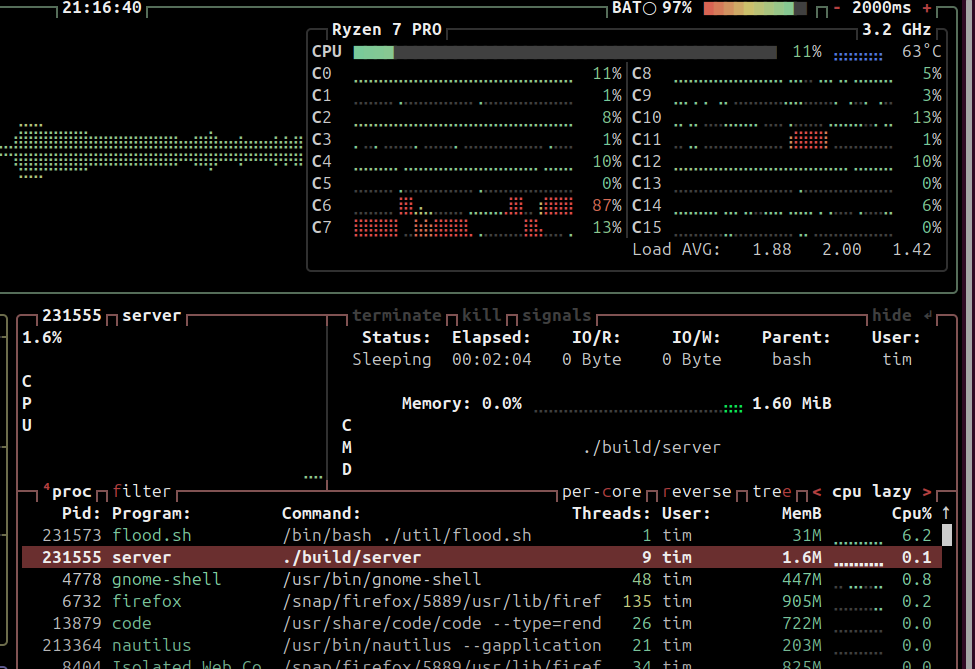

# Konami test

## Description
Example program for a job interview\
Written by Tim Thompson\
Started March 11, 2025  at 9am

##  Build
There are 3 build targets, default, debug, and clean
#### Normal build (for 'prod')
```make```

#### Debug buid
```make debug```

#### Remove all generated output
```make clean```

## Summary
The program is split into 2 parts, client and server. The server is multi-threaded and has some tunible settings in constants.h.  I used a library called yxml to do the heavy lifting on the parsing\
[yxml](https://github.com/JulStrat/yxml)\
**Server**\
The server program consists of a socket listener that accepts incomming messages, validates the message (using yxml on the main server thread to check for any  negative return codes), then adds that message to the head of a work queue.   There is a pool of 'worker' threads that monitor the work queue and pull unprocessed messages off the tail of the queue.  In the worker thread, the XML message is parsed for the "Command" tag, and if found, the value of the Command tag along with the date the server received the message are printed out on the server console (stdout).  The server gets a timestamp and stores it with the message in the work queue immediatly after the message passes the validation test.  That is the timestamp that client uses to print out the date.\
**Client**\
The client program is simpler.   It opens a socket, connects to the server, reads in a xml file (that is named a .txt file per the requirements document), sends that XML message, and waits for a response from the server.  After the message is processed, the worker thead will return the "ACK" string, indicating to the client the message was successfully processed back to the client via the response socket that accept() opens for us.  That socket is also stored in the message along with the timestamp taken at message Rx time\
*\
*
## Usage
Note that the BENCHMARKS constant needs to be off to see output from the client and server programs.\
Per requiements, both programs have settable IP/port, and defaults as specified\
After building, run all items from the root directory of the project

To run the server with defaults:\
```./build/server```

To run the client with defaults:\
```./build/client ./messages/xml-message.txt```\
There are several messages to use in the messages directory

### Options
Both server and client programs will accept optional parms for ip and port\
server:\
```./build/server 127.0.0.1 5010```\
client:\
```./build/client 127.0.0.1 5010 ./messages/xml-message.txt```


## Utilities
### gen_xml.py
I had XML on the brain so I coded something in Python quick to generate the message files\
Taking time to lay the example schema out so that the program generated the pattern in the requirements document was useful to get the document structure in my head.  This utility generates the same text in every file it creates, any differentiation must be added by hand.
### flood.sh
Simple shell script to call the client one hundered thousand times and background it.  Useful to run it with 'time' in front of it to 'benchmark' the server.  It always tells the client to send the same file

## Testing
The good path works, and takes a decent amount of load with the flood shell script.  The client can't hammer the server nearly hard enough, it keeps up even with one thread.

#### Error case: Malformed XML
Use the client to send a malformed XML message (this one is missing the /Data tag).  Result will be "Unknown Command" printed out in the server.  The client will recieve a not success response as well\
```./build/client ./messages/xml-error.txt```
#### Hard case: Target XML tag not the first element
The Requirements document proved XML data had the tag we're looking for as the first element of the Message.  So I meanually reordered one of the messages to have the Command tag last, to ensure the server can still parse it.  It does.  I also changed the value of the Command to be something other than Print\
The server parses this message per the requirements and prints out the correct value for Command\
```./build/client ./messages/xml-order.txt```\
No automated testing has been provided\
*\
The following image shows the server running with 8 worker threads (plus main for a total of 9 threads).   It doesn't even  use 2 Megs of memory\
*\

*
## Bugs
The client lacks threading, it can't hammer the server nearly hard enough. I think it spends too much time building/tearing down sockets.  This means the server might have threading/lost update bugs because it doesn't get stressed very  much.   I have provided a screenshot of the client/server running with the flood.sh  script I have provided, the script is at 99% dispatch in top and the server is usually around 2%.  You can also see proof the server is running the correct thread count (worker thread count +1 for the main thread) via btop.\
*\
I have buffer overflow checks in place, but I just kind of drop the message and don't give a good error that we ran out of buffer space.  This is a bug, and there needs to be test cases with  huge fileds to test for buffer overflows.  Valgrind may be useful in this as well.\
*\
*
## Final Thoughts
This was a fun project.  I have done pthreads before and queues are easy in C, so I cranked that part out first.  There is no dynamic memory usage in this program because I didn't need to do it, but I assure you I known how to use malloc and free :).  The XML in C was harder to get right.  I think the MOST time I spent on the YXML part was trying to get the library integrated seamlessly into my project.  I spent at least half a day in Makefile hell, and it STILL is not right.  I could not get it to build Yxml libs in the build directory, they are all in the root directory of the project.  But it DOES build yxml, and it DOES clean the yxml object file with make clean.  It builds so fast it's hard to tell it's doing extra work to rebuild the yxml every time.\
*\
I would have liked to add some automated testing with Travis in python, and more error xml messages. I would also like to enhance the client to be multi-threaded and to send multiple messages at once after it does all that work of opening the socket. I think most of the client time is spent opening/closing the socket, not sending the message.  I would like to do a multi-threaded client in Python as well, and maybe some more artistic testing with a python client.  It is faster to do  things like that in Python than in C.\
*\
I am out of time now, my flight leaves in a few hours, so I have to end my work on this project.  I think it's done enough, and I have yet to work on any software project that has ever been completely done.   There is more I could do to this to make it better.   I have about 20 hours of work into this.  You can see my steps by running git log and seeing my commits over the last 2 days.\
I also have this project up as a private repository on Github.  I will delete it off there in a few weeks, as I assume you do not want this test anywhere on the internet.  Url is:\
https://github.com/timothom/konami_test/ \
It is private, so hopefully that shows up as a 404 link for you.  If you want access, email/text me your  github user ID and I'll add it as a reader.  I find github's online code review tools to be great.\
*\
If looking at this locally, I'd suggest using vscode and browsing the commit history.  Showing commits for a project like this is akin to 'showing your work' in classes like Calculas.\
*\
Thank you for the oppertunity and I hope to hear from you soon.


